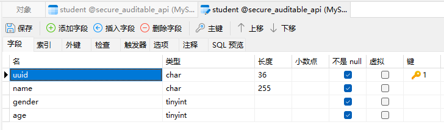
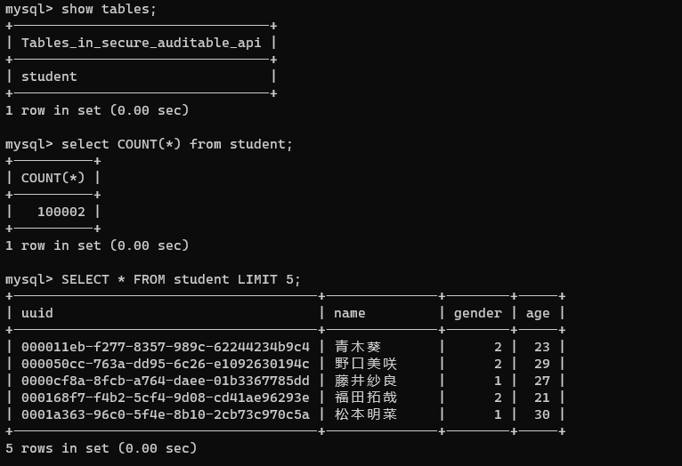

# 实现可审计的安全API设计

> 21301114 俞贤皓

## 1. 作业要求

### 1.1 本地数据库创建（10分）

* 创建一张Student表，有字段：id（主键），name，gender，age
  * 
* 往数据库中随机生产10万条学生信息
  * 使用Navicat生成
  * 

### 1.2 实现学生信息查询接口（70分）

* 接口简略定义

  | 方法 | URL             | 功能                                                      |
  | ---- | --------------- | --------------------------------------------------------- |
  | GET  | /students/{id}  | 查询单个Student信息                                       |
  | GET  | /students?limit | 查询所有Student信息，随机返回limit个，最多&默认返回1000个 |

#### 1.2.1 学生信息查询接口，入参为1~1000的int值，返回相应数量的随机学生信息（20分）

* 