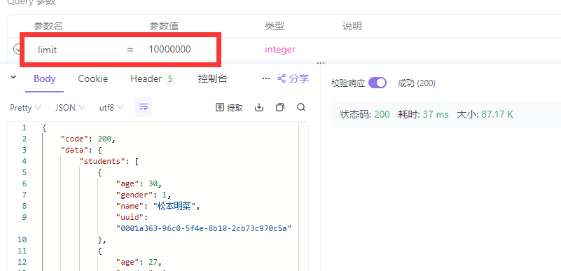

# 实现可审计的安全API设计

> 21301114 俞贤皓

## 1. 作业要求

* `.`/ 根目录包含了SpringBoot环境
* `./README.pdf` 为作业报告
* `./qps_test`/ 包含了qps实验数据
* `./tools/js_tool/` 包含了用于测试的curl脚本文件（包括可视化绘图脚本）
* `./student.sql` 提交文件1：数据库SQL+Data
* 演示视频百度云链接
  * 链接：https://pan.baidu.com/s/1_nET-5wwCud3GOVbNl4zTg?pwd=2333 
  * 提取码：2333 

### 1.1 本地数据库创建（10分）

* 创建一张Student表，有字段：id（主键），name，gender，age
  * 
* 往数据库中随机生产10万条学生信息
  * 使用Navicat生成
  * 

### 1.2 实现学生信息查询接口（70分）

* 接口简略定义

  | 方法 | URL             | 功能                                 | 备注                |
  | ---- | --------------- | ------------------------------------ | ------------------- |
  | GET  | /students/{id}  | 查询单个Student信息                  | 此接口已被禁用      |
  | GET  | /students?limit | 查询所有Student信息，随机返回limit个 | 最多&默认返回1000个 |

#### 1.2.1 学生信息查询接口，入参为1~1000的int值，返回相应数量的随机学生信息（20分）

* 思路
  * 先实现：SpringBoot取出所有记录，并返回前1000条，耗时约 450ms
  * 再实现：SpringBoot取出所有记录，随机打乱，并返回前1000条，耗时约 650ms
  * 再实现：SpringBoot在数据库中随机打乱，并取出1000条记录，耗时约 120ms
  * 优化：
    * 考虑使用如下SQL语句对记录进行随机采样：`SELECT * FROM student WHERE RAND() < 0.02`
    * 这样可以从10w条记录中先随机筛出2%条，即筛出大约2000条
    * 然后再从这2000条中取出前1000条，既可以实现随机采样1000条
    * 耗时约40ms
* 截图演示
  * 

#### 1.2.2 入参异常值的接口自我保护

* 对于Nullable查询均进行判空

  ```java
  if (studentPojo == null) {
      return Utils.getResponse(404, "Student not found");
  } else {
      return Utils.getOkResponse(
              "Success",
              studentPojo.toHashMap()
      );
  }
  ```

* 对limit进行限制

  ```java
  int limitValue = limit == null ? 1000 : max(1, min(limit, 1000));
  ```

* 截图演示

  * Limit过大

    

  * Limit为非正整数

    

#### 1.2.3 当前接口承接流量大小的监控（每秒多少条请求）

* 监控接口qps，每10s输出取均值输出一次

  ```java
  private static final int qpsLogDuration = 10000;
  @Scheduled(fixedRate = qpsLogDuration)
  public void logQPS() {
      long startTime = System.currentTimeMillis() - qpsLogDuration;
      long requestCount = requestCounter.getAndSet(0);
      long requestTime = requestTimeSum.getAndSet(0);
      logger.info(
              "[{}] QPS: {}; Average Duration: {} ms",
              getDateTime(startTime),
              requestCount / 10.0,
              (requestCount == 0 ? 0 : requestTime / requestCount)
      );
  }
  ```

* 后端监控演示

  * 

* 实现了一个简易的javascript脚本，用于进行压力测试

  * **脚本位于 `./tools/js_tool/` 目录下**
  * 压力测试参数：qps、请求记录条数(入参limit)、压力测试时长
  * 下图为：qps=10.0，入参limit=10，时长=20s
  * 

#### 1.2.4  当前接口每条请求响应时间的监控（接口耗时），并分析不同qps下的性能

* 对接口响应时间进行监控

  ```java
  long startTime = System.currentTimeMillis();
  
  // processing
  
  long endTime = System.currentTimeMillis();
  long duration = endTime - startTime;
  logger.info("Request received at [{}] processed in {} ms", getDateTime(startTime), duration);
  requestCounter.incrementAndGet(); // qps counter
  
  return response;
  ```

* 截图演示

  * 

* 实验：不同qps下的性能

  * 具体实验数据请参见 **`./qps_test`** 目录

  * 注：Limit为1000时，对系统几乎没有影响。所以我将系统参数调整后，对Limit为10k也进行了测试。

  * | 编号 | QPS  | Limit | 测试时长 (sec) | 请求平均耗时 (ms) |
    | ---- | ---- | ----- | -------------- | ----------------- |
    | 1    | 1    | 1     | 10             | 39.5              |
    | 2    | 1    | 10    | 10             | 39.5              |
    | 3    | 1    | 100   | 10             | 37.9              |
    | 4    | 1    | 1000  | 10             | 37.5              |
    | 5    | 1    | 10000 | 10             | 99.2              |
    | 6    | 10   | 1     | 10             | 35.9              |
    | 7    | 10   | 10    | 10             | 33.7              |
    | 8    | 10   | 100   | 10             | 36.4              |
    | 9    | 10   | 1000  | 10             | 36.5              |
    | 10   | 10   | 10000 | 20             | 91.1              |
    | 11   | 50   | 1     | 10             | 37.1              |
    | 12   | 50   | 10    | 10             | 35.9              |
    | 13   | 50   | 100   | 10             | 36.3              |
    | 14   | 50   | 1000  | 10             | 35.4              |
    | 15   | 50   | 10000 | 20             | 133.7             |
    | 16   | 100  | 10000 | 20             | 3869.9            |
    | 17   | 500  | 10000 | 20             | -                 |

  * 注：第17次实验，前端压力测试脚本卡顿比较厉害，导致请求被延迟发送

    * 后端springboot倒是正常处理请求，目测延迟大概仍然在3500~4500ms
    * springboot很厉害，每个请求都还能正常返回

  * 又让每次处理请求Sleep 5秒，想看看springboot会不会宕机

    * 然后发现springboot每次请求的时间还是很短，平均在5000ms~5100ms之间。所以之前请求平均耗时实际上是MySQL端负载过大，而Sleep并不消耗计算资源，如果把Sleep换成运算的话，springboot端应该就阻塞了。
    * 发现这种情况下，前后端请求计时数据不同，所以怀疑是前端axios库阻塞之类的。

  * 又让每次处理计算1e8次乘法，然后发现springboot的处理时间开始累计，时间变长，我的电脑越来越卡，于是就停止实验了

    * 执行约30s后，每个请求平均就需要20秒。

#### 1.2.5 接口信息运行信息日志（包括系统+业务信息），统计各档位（1~1000入参分10个档）的平均耗时

* 接口信息运行信息日志
  * 现在每个请求，日志会输出请求时间和耗时（系统信息），还会输出了用户的请求的记录条数（业务信息）
  * 
* 统计各档位的平均耗时
  * 

#### 1.2.6 qps保护（即qps>10时，抛弃多余的请求）

* 写了一个qps limit

  ```java
  long requestCount = requestCounter.get();
  if (requestCount / QPS_LOG_DURATION_SECONDS >= QPS_LIMIT) {
      logger.warn("Too Many Requests");
      return Utils.getResponse(429, "Too Many Requests");
  }
  ```

* 截图预览

  * 

* Apifox在qps保护启动时发送请求

  * 

### 1.3 实现批量curl请求的脚本

* **脚本位于 `./tools/js_tool/` 目录下**

* 使用JavaScript编写，通过axios发送请求，通过chart.js绘图

  * Node.js v18.18.2

* ```javascript
  const axios = require('axios')
  const { ChartJSNodeCanvas } = require('chartjs-node-canvas');
  const { promises } = require('fs');
  
  const url = 'http://localhost:8080/students'
  const qps = 30.0 // queries per second
  const request_interval = 1000.0 / qps
  const log_time = 10.0 // seconds
  const limit_min = 1
  const limit_max = 1000
  
  let success_count = 0
  let failure_count = 0
  let total_time_elapsed = 0
  let request_count = 0
  let request_id = 0
  
  let request_info = {
      "success": {},
      "failure": {},
  }
  
  function sendRequest() {
      const startTime = Date.now()
      const limit = Math.floor(Math.random() * (limit_max - limit_min + 1) + limit_min)
      axios.get(url, { params: { limit: limit } })
          .then(response => {
              // ...处理success（详见具体脚本文件）
          })
          .catch(error => {
          	// ...处理failure（详见具体脚本文件）
          })
  }
  
  async function visualizeStats() {
      // ...绘图（详见具体脚本文件）
  }
  
  function printStats() {
      // ...日志（详见具体脚本文件）
      visualizeStats();
  }
  
  console.log(`Starting stress test to ${url} ...`)
  const interval_id = setInterval(() => {
      request_count += 1
      sendRequest()
      if (request_count * request_interval >= log_time * 1000) {
          clearInterval(interval_id)
          setTimeout(printStats, 3000) // ensure all requests are finished
      }
  }, request_interval)
  ```

#### 1.3.1 能定制输入qps，按照相应设定值进行导流

* 完成，只需要在脚本开头调整 qps, log_time, limit_min, limit_max, url 等参数，便可以根据具体情况进行测试

#### 1.3.2 对接口返回成功率进行监控

* 完成，脚本记录了成功次数和失败次数，在printStats函数中进行输出

#### 1.3.3 监控能用可视化的形式表现

* 完成，在visualizeStats函数中将可视化结果输出到图片文件中
* 图片预览
  * 
  * 横坐标是该请求的响应时间，纵坐标是该响应时间对应的请求次数
  * 左侧为失败请求（因为qps限制）
  * 右侧为成功请求
  * 颜色可以调，彩色是因为好看，生产环境中只会用红色和绿色

## 2. 总结

* 我完成了本次作业中 **所有** 的得分点和 **bonus**


